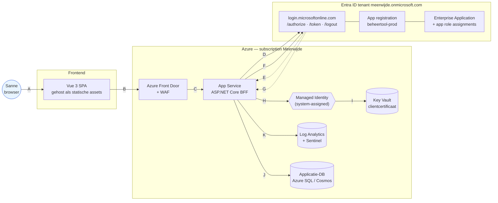
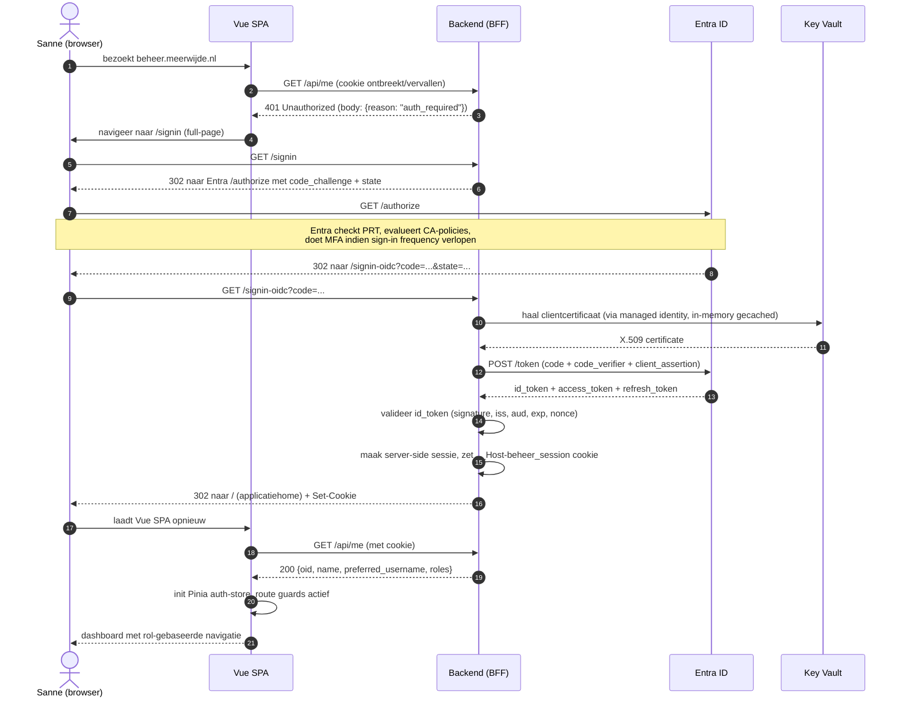

# Architectuur en communicatie

Twee diagrammen: een componentendiagram dat de statische relaties toont, en een sequencediagram dat de inlogflow stap voor stap laat zien. Onder elk diagram staat een tabel met beschrijving van elke lijn.

## Componenten-overzicht

### Proceslijnen

| Lijn | Van → Naar | Beschrijving |
|------|------------|--------------|
| A | Sanne → Vue SPA | Sanne opent `https://beheer.meerwijde.nl`; Azure Front Door serveert de statische Vue-bundle |
| B | Vue SPA → Front Door | Alle `/api/*` calls vanuit de SPA gaan via `fetch()` met `credentials: 'include'` zodat de sessiecookie meereist |
| C | Front Door → App Service | WAF-regels evalueren, OWASP ruleset, daarna private endpoint naar App Service |
| D | App Service → Entra authorize | Initiële OIDC-redirect: `GET /authorize?response_type=code&scope=openid+profile+email+offline_access&code_challenge=...&state=...&nonce=...` |
| E | Entra → App Service | Redirect terug met `code` op `/signin-oidc` na succesvolle authenticatie en CA-evaluatie |
| F | App Service → Entra token | `POST /token` met `code + code_verifier + client_assertion` (JWT ondertekend met clientcertificaat) |
| G | Entra → App Service | Levert `id_token`, `access_token`, `refresh_token` terug |
| H | App Service → Managed Identity | Backend gebruikt de system-assigned managed identity om Key Vault aan te spreken |
| I | Managed Identity → Key Vault | Ophalen van het clientcertificaat voor token-endpoint (gebeurt bij opstart, in-memory gecached tot rotatie) |
| J | App Service → Applicatie-DB | Reguliere applicatie-queries (dossiers, aantekeningen) — buiten A1-scope |
| K | App Service → Log Analytics | Sign-in-events, audit-events en applicatie-logs (zie `../07-compliance-en-auditlogging.md`) |

## Inlogflow — sequentie

### Beschrijving per stap

| Stap | Beschrijving |
|------|--------------|
| 1 | Sanne opent de app in haar browser |
| 2 | Vue checkt bij opstart of er een actieve sessie is via `/api/me` |
| 3 | Backend vindt geen/een verlopen sessiecookie en antwoordt met 401 |
| 4 | Vue redirect de hele pagina naar `/signin` (geen AJAX — we hebben een full-page redirect nodig voor OIDC) |
| 5 | Browser vraagt de backend om te starten met authenticatie |
| 6 | Backend bouwt een OIDC-authorize-URL met PKCE (`code_challenge`), `state` en `nonce` en stuurt een 302 |
| 7 | Browser volgt de redirect naar Entra |
| 8 | Entra controleert of Sanne al aangemeld is (via Primary Refresh Token), evalueert Conditional Access; bij sign-in-frequency > 8u vraagt Entra opnieuw om MFA |
| 9 | Entra redirect terug naar de BFF met een autorisatiecode |
| 10 | Browser roept het redirect-endpoint van de backend aan |
| 11-12 | Backend haalt het clientcertificaat uit Key Vault via haar managed identity (eerste keer; daarna cached) |
| 13 | Backend ruilt de code in bij het Entra-token-endpoint, geauthenticeerd met `client_assertion` (JWT ondertekend met het certificaat) |
| 14 | Entra levert de tokens terug |
| 15 | Backend valideert het ID-token-handtekening en claims; vergelijkt `nonce` met de waarde uit de initiële request |
| 16 | Backend maakt een server-side sessie aan, koppelt claims (incl. `roles`) en zet `Set-Cookie: __Host-beheer_session=...; HttpOnly; Secure; SameSite=Lax; Path=/` |
| 17 | Backend stuurt 302 naar de applicatiehome |
| 18 | Browser laadt de Vue SPA |
| 19 | Vue vraagt via `/api/me` de gebruikersgegevens op, nu met de zojuist geplaatste cookie |
| 20 | Backend valideert de cookie en geeft de relevante claims terug |
| 21 | Vue initialiseert de auth-store (Pinia) en activeert router-guards |
| 22 | Sanne ziet het dashboard, menuitems worden op basis van `roles` wel of niet weergegeven |

## Zero-trust effect

Elk van deze lijnen heeft een eigen controle:

- **B/C** — WAF blokkeert kwaadaardige patronen vóór ze de applicatie raken
- **D/F** — PKCE voorkomt dat een onderschepte code bruikbaar is
- **F** — clientcertificaat (in plaats van shared secret) betekent dat een gestolen configuratie niet volstaat om tokens op te vragen
- **H/I** — managed identity + Key Vault zorgen dat het certificaat nergens in applicatieconfiguratie als statisch geheim bestaat
- **16** — cookie-attributen (`__Host-`, `HttpOnly`, `Secure`, `SameSite`) neutraliseren klassieke sessie-diefstalpatronen

De applicatie vertrouwt op geen enkel moment op "ik heb een bearer token, dus je mag erin" — elk request tegen `/api/*` wordt opnieuw tegen de server-side sessie gevalideerd en, dankzij CAE, kan de backend binnen minuten reageren op een intrekking door Entra (zie `../06-sessie-en-tokens.md`).
