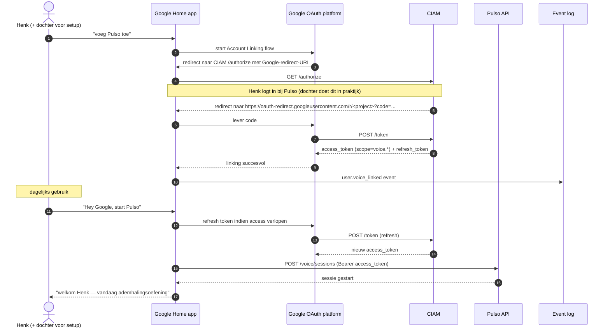

# Architectuur en communicatie

Twee soorten diagrammen: (1) een overkoepelend componentendiagram dat alle kanalen naast elkaar toont en (2) sequencediagrammen per kanaal die de feitelijke authenticatieflow laten zien. Onder elk diagram een korte beschrijving.

## Componenten — multi-kanaals topologie

```mermaid
flowchart LR
  %% Gebruikers en hun devices
  Amira((Amira)):::actor
  Thomas((Thomas)):::actor
  Henk((Henk)):::actor
  Nadia((Nadia)):::actor

  subgraph Devices["Device-klassen"]
    Web["Web SPA<br/>Vue 3"]
    IOS["iOS app"]
    AND["Android app"]
    Watch["Apple Watch / Wear OS<br/>companion"]
    SA["Stand-alone wearable<br/>(Device Flow)"]
    GH["Google Home"]
    AL["Alexa"]
    GPT["ChatGPT Actions"]
    Claude["Claude MCP-client"]
    Glass["Smart glasses"]
  end

  subgraph Edge["Edge"]
    CF["CloudFront + WAF"]
  end

  subgraph PulsoAWS["Pulso AWS (eu-west-1 / us-east-1)"]
    BFF["BFF<br/>Node 20 + Fastify"]
    API["Pulso API<br/>(workouts, profile, ...)"]
    MCP["MCP-server<br/>(DCR + OAuth)"]
    RISK["Risk-engine<br/>(velocity, attest, breach)"]
    DB[(Aurora PostgreSQL<br/>DynamoDB sessies)]
    LOG["Event-ingestion<br/>→ Datadog + S3"]
  end

  subgraph CIAM["CIAM — Variant A Auth0 / Variant B Keycloak"]
    AZ["/authorize"]
    TOK["/token"]
    DEV["/device/code"]
    REG["/register (DCR, LLM)"]
    ADM["Admin API<br/>(sessions, users)"]
    EV["Event stream<br/>(webhooks)"]
  end

  subgraph Ext["Externe platforms"]
    Apple["Sign in with Apple"]
    Google["Sign in with Google / Google Home platform"]
    MS["Microsoft"]
    FB["Facebook"]
    AM["Amazon / Alexa"]
    OAI["OpenAI ChatGPT"]
    ANT["Anthropic Claude"]
  end

  Amira --> Web
  Amira --> IOS
  Amira --> Watch
  Thomas --> Web
  Thomas --> IOS
  Henk --> GH
  Henk --> AL
  Nadia --> IOS
  Nadia --> GPT
  Nadia --> Claude
  Nadia --> Glass

  Web -->|1| CF
  IOS -->|2| CF
  AND -->|2| CF
  Watch -->|3| IOS
  SA -->|4| DEV
  GH -->|5| AZ
  AL -->|5| AZ
  GPT -->|6| AZ
  Claude -->|7| REG
  Glass -->|8| DEV

  CF --> BFF
  CF --> API
  CF --> MCP

  BFF -->|OIDC| AZ
  BFF -->|OIDC| TOK
  BFF --> API
  BFF --> DB

  IOS -->|PKCE| AZ
  IOS --> TOK
  AND -->|PKCE| AZ
  AND --> TOK

  API --> DB
  API --> RISK
  API --> LOG
  MCP --> AZ
  RISK --> EV

  CIAM -.federates.-> Apple
  CIAM -.federates.-> Google
  CIAM -.federates.-> MS
  CIAM -.federates.-> FB
  GH -. OAuth .-> Google
  AL -. OAuth .-> AM
  GPT -. OAuth .-> OAI
  Claude -. OAuth+DCR .-> ANT

  EV --> LOG
  ADM --> BFF

  classDef actor fill:#fff3cd,stroke:#856404
```



### Proceslijnen — overzicht

| Lijn | Kanaal | Flow |
|------|--------|------|
| 1 | Web | OIDC Authorization Code + PKCE via BFF; sessiecookie richting browser |
| 2 | iOS / Android native | OAuth 2.0 Authorization Code + PKCE, public client, ASWebAuthenticationSession / Custom Tabs |
| 3 | Apple Watch / Wear OS | Shared Keychain / Account group met iOS/Android parent-app |
| 4 | Stand-alone wearable | OAuth 2.0 Device Authorization Grant (RFC 8628) |
| 5 | Google Home / Alexa | OAuth 2.0 Account Linking (Authorization Code) via platform-specifieke redirect-URI |
| 6 | ChatGPT Actions | OAuth 2.0 Authorization Code + PKCE via ChatGPT's client |
| 7 | Claude MCP | OAuth 2.0 + Dynamic Client Registration via Pulso's MCP-server |
| 8 | Smart glasses | Device Flow of QR-handoff naar mobile app |

Alle flows landen bij dezelfde CIAM (Auth0 of Keycloak); alle tokens zijn gescoped per kanaal; alle events gaan via de event-stream naar de logs.

## Sequencediagram — Web (BFF, passkey)

```mermaid
sequenceDiagram
  autonumber
  actor U as Amira (browser)
  participant V as Vue SPA
  participant B as BFF (Fastify)
  participant C as CIAM (/authorize, /token, JWKS)
  participant DB as Aurora DB

  U->>V: bezoek app.pulso.com
  V->>B: GET /api/me (cookie ontbreekt)
  B-->>V: 401 {reason: "auth_required"}
  V->>U: full-page navigate naar /signin
  U->>B: GET /signin
  B-->>U: 302 naar CIAM /authorize met PKCE challenge, state, nonce
  U->>C: GET /authorize
  Note over U,C: Universal Login, passkey-assertion via WebAuthn
  C-->>U: 302 naar BFF /callback?code=...&state=...
  U->>B: GET /callback
  B->>C: POST /token (code + verifier + client_secret/cert)
  C-->>B: id_token + access_token + refresh_token
  B->>B: valideer id_token via JWKS; check nonce
  B->>DB: upsert user (sub, email)
  B->>B: maak sessie, set __Host-pulso_session cookie
  B-->>U: 302 naar /dashboard + Set-Cookie
  U->>V: laad SPA
  V->>B: GET /api/me (met cookie)
  B-->>V: 200 {sub, email, name, consents}
  V-->>U: dashboard
```

## Sequencediagram — iOS (native, passkey)

```mermaid
sequenceDiagram
  autonumber
  actor U as Amira (iPhone)
  participant IOS as Pulso iOS-app
  participant SB as ASWebAuthenticationSession
  participant C as CIAM
  participant API as Pulso API
  participant KC as iOS Keychain

  U->>IOS: open app
  IOS->>IOS: genereer code_verifier + code_challenge
  IOS->>SB: startURL = https://auth.pulso.com/authorize?...&code_challenge=...
  SB->>C: GET /authorize
  Note over SB,C: Universal Login; iCloud Keychain biedt passkey; Face ID
  C-->>SB: redirect com.pulso.app://callback?code=...
  SB->>IOS: deeplink met code
  IOS->>C: POST /token (code + verifier, public client)
  C-->>IOS: id_token + access_token + refresh_token
  IOS->>KC: store refresh_token met .biometryCurrentSet
  IOS->>API: GET /workouts (Bearer access_token + DPoP JWT)
  API-->>IOS: 200 + data
  IOS-->>U: workouts view
```

## Sequencediagram — Device Flow (stand-alone wearable / smart glasses)

```mermaid
sequenceDiagram
  autonumber
  actor U as Nadia
  participant G as Smart glasses
  participant M as iPhone (browser)
  participant C as CIAM
  participant LOG as Event log

  U->>G: start Pulso-module
  G->>C: POST /device/code (client_id, scope)
  C-->>G: device_code, user_code=PULS-X4Q2, verification_uri
  G-->>U: toon QR "scan voor activeren"<br/>+ user_code als fallback
  U->>M: scan QR → open https://pulso.com/activate?user_code=PULS-X4Q2
  M->>C: GET /authorize (BFF-flow)
  Note over M,C: Standaard login + step-up indien nieuw device-type
  M-->>U: bevestigings-pagina "Smart glasses koppelen?"
  U->>M: bevestig
  M->>C: POST bevestiging
  loop elke interval seconden
    G->>C: POST /token grant_type=device_code
    C-->>G: authorization_pending
  end
  G->>C: POST /token (na bevestiging)
  C-->>G: access_token + refresh_token
  G->>LOG: device.linked event
  G-->>U: "gekoppeld; begin workout"
```

## Sequencediagram — Google Home Account Linking



## Sequencediagram — Claude MCP met DCR

```mermaid
sequenceDiagram
  autonumber
  actor U as Nadia
  participant CL as Claude
  participant MCP as Pulso MCP-server
  participant C as CIAM
  participant API as Pulso API

  U->>CL: voeg Pulso toe als MCP-server (mcp.pulso.com)
  CL->>MCP: POST /register (DCR)
  MCP->>C: creeer nieuwe OAuth client
  C-->>MCP: client_id + (geen secret, public + PKCE)
  MCP-->>CL: client_id
  CL->>MCP: GET /authorize (via Claude's OAuth-flow)
  MCP->>C: redirect GET /authorize
  Note over U,C: Consent-scherm; Nadia kiest scopes workouts.read
  C-->>CL: redirect met code
  CL->>MCP: POST /token (code + verifier)
  MCP->>C: relay POST /token
  C-->>MCP: access_token (scope=workouts.read) + refresh_token (30d cap)
  MCP-->>CL: tokens
  U->>CL: "Claude, hoe liep mijn Pulso-week?"
  CL->>MCP: MCP-call tools/workouts/list (Bearer access_token)
  MCP->>API: GET /workouts/recent
  API-->>MCP: 200 data
  MCP-->>CL: gestructureerde response
  CL-->>U: natuurlijke taal antwoord
```

## Zero-trust effect

Per lijn hangt een eigen controle:

- **Web/BFF** — WAF, PKCE, BFF-cookie met `__Host-` + `HttpOnly` + `Secure` + `SameSite=Lax`
- **Mobile** — PKCE + biometric unlock + DPoP + app-attest/Play Integrity
- **Device Flow** — user-code-bevestiging op ander device; geen secret op limited-UI device
- **Voice (Account Linking)** — volledige OAuth-flow uitgevoerd op koppelend device, Voice Match-signaal voor daarna
- **LLM-DCR** — per-client token, per-scope opt-in, 30-dagen re-consent-cap
- **Overal** — refresh-token rotation met reuse-detection; scope-minimalisatie; event-stream voor audit

Elk kanaal heeft zijn eigen aanvalsoppervlak; elk kanaal zijn eigen verdediging. De applicatie vertrouwt op geen enkel kanaal blindelings — alle API-calls worden scope-gecontroleerd en bij verhoogd risico komt de risk-engine via de event-stream tussenbeide.

## Per-variant voortzetting

De feitelijke configuratie en codevoorbeelden per CIAM staan in:

- [Variant A — Auth0](./variant-a-auth0/) (Node/Fastify BFF + Vue SPA)
- [Variant B — Keycloak](./variant-b-keycloak/) (Node/Fastify BFF + Vue SPA)
- [Variant C — Zitadel](./variant-c-zitadel/) (FastAPI API + Nuxt.js Nitro-BFF)

Variant C heeft een eigen [architectuur-pagina](./variant-c-zitadel/architectuur) met specifieke Nuxt ↔ FastAPI ↔ Zitadel-sequencediagrammen, omdat de rolverdeling tussen frontend-server en API wezenlijk anders is.
