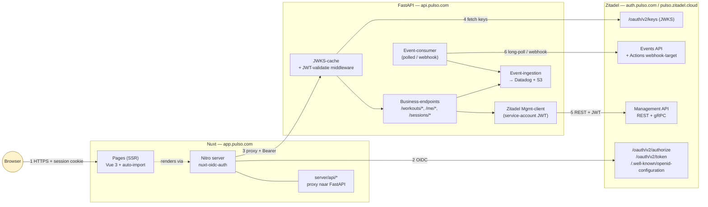
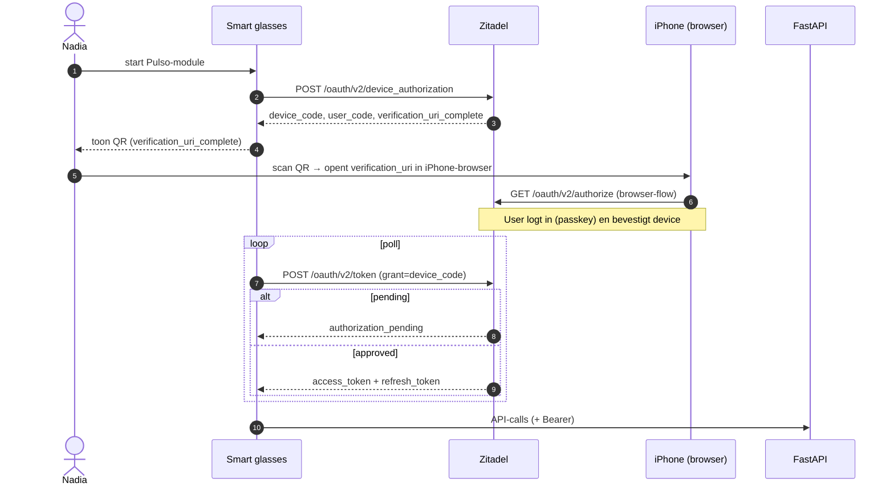

# Architectuur — Variant C (Nuxt + FastAPI + Zitadel)

Deze pagina toont de rolverdeling tussen Nuxt-server, FastAPI en Zitadel. Het verschil met variant A/B zit vooral in de frontend-laag: waar een Vue-SPA + Node-BFF twee processen waren, is Nuxt één proces met een ingebouwde server (Nitro) die beide rollen vervult.

## Rolverdeling

| Laag | Verantwoordelijkheid |
|------|----------------------|
| **Browser** | Pagina's bekijken, sessie-cookie van Nuxt-server gebruiken. **Geen tokens in JavaScript**. |
| **Nuxt Nitro-server** | OIDC Authorization Code + PKCE tegen Zitadel; SSR voor de pagina's; server-side sessiestate (versleutelde cookie); proxy `server/api/*` → FastAPI met Bearer-token uit de session |
| **FastAPI** | Pure business-API; valideert Bearer-tokens via Zitadel's JWKS; roept Zitadel Management API aan voor admin-operaties; consumeert Zitadel event-stream |
| **Zitadel** | IdP. Authenticatie, passkey-flow, MFA, token-uitgifte, refresh-rotation, Device Flow, Account Linking, DCR (via Mgmt API). Bron van audit-events. |

## Componentendiagram



### Proceslijnen

| Lijn | Van → Naar | Inhoud |
|------|-------------|--------|
| 1 | Browser → Nuxt | HTML + AJAX `/api/*` met `__Host-pulso_session` cookie |
| 2 | Nuxt Nitro → Zitadel | OIDC Authorization Code + PKCE; server-side; session-cookie wordt met encrypted session + access/refresh tokens bijgewerkt |
| 3 | Nuxt Nitro → FastAPI | Proxy van `/api/*` naar `api.pulso.com`, met `Authorization: Bearer <access_token>` uit de Nitro-sessie |
| 4 | FastAPI → Zitadel JWKS | JWKS-keys ophalen voor JWT-verificatie; gecached in Redis (TTL 1 uur, force-refresh bij `kid`-miss) |
| 5 | FastAPI Mgmt-client → Zitadel Management API | Service-account JWT-profile-assertion → access-token; admin-operaties zoals "session revoken", "user metadata updaten" |
| 6 | FastAPI Events-consumer → Zitadel Events | Polled of webhook-getriggerd; events doorschrijven naar Datadog + S3 Glacier |

## Sequencediagram — Web login (Nuxt + Zitadel)

```mermaid
sequenceDiagram
  autonumber
  actor U as Amira (browser)
  participant N as Nuxt Nitro
  participant Z as Zitadel
  participant F as FastAPI

  U->>N: GET /dashboard
  N->>N: check sessie
  alt geen sessie
    N-->>U: 302 → /auth/login (server-handler)
    U->>N: GET /auth/login
    N->>N: genereer code_verifier + state + nonce
    N-->>U: 302 → Zitadel /oauth/v2/authorize?...&code_challenge=...
    U->>Z: GET /oauth/v2/authorize
    Note over U,Z: Zitadel Universal Login;<br/>passkey via WebAuthn
    Z-->>U: 302 → Nuxt /auth/zitadel/callback?code=...
    U->>N: GET /auth/zitadel/callback
    N->>Z: POST /oauth/v2/token (code + code_verifier)
    Z-->>N: id_token + access_token + refresh_token
    N->>N: valideer id_token (JWKS, nonce, aud)
    N->>N: encrypt tokens in session; set __Host-pulso_session
    N-->>U: 302 → /dashboard + Set-Cookie
  end

  U->>N: GET /dashboard (met cookie)
  N->>N: SSR-render; haal data via server/api
  N->>F: GET /api/workouts (+ Bearer from session)
  F->>F: valideer JWT via JWKS
  F-->>N: 200 { workouts: [...] }
  N-->>U: HTML met dashboard
```

## Sequencediagram — Token-refresh (Nuxt server, transparant)

```mermaid
sequenceDiagram
  autonumber
  participant N as Nuxt Nitro
  participant Z as Zitadel
  participant F as FastAPI

  Note over N: Inkomend request; session.expires_at < now + 60s
  N->>Z: POST /oauth/v2/token (grant=refresh_token)
  alt succes
    Z-->>N: nieuw access + nieuw refresh (rotation)
    N->>N: update encrypted session cookie
  else invalid_grant (reuse-detectie)
    Z-->>N: 400 invalid_grant
    N->>N: wis sessie
    N-->>N: 401 → redirect /auth/login
  end
  N->>F: GET /api/... + Bearer (nieuwe access_token)
  F-->>N: 200
```

Pulso benut Zitadel's ingebouwde **refresh-token-rotation + reuse-detection** (in de project-application-instellingen). Valt het refresh-token in verkeerde handen en wordt het ooit nog gebruikt, dan vervalt de hele family en moet de gebruiker opnieuw inloggen — hetzelfde patroon als in variant A/B.

## Sequencediagram — Mobile (iOS/Android) direct tegen Zitadel

Mobile apps spreken rechtstreeks met Zitadel (Nuxt is niet in de weg), en praten direct met FastAPI:

```mermaid
sequenceDiagram
  autonumber
  actor U as Amira (iPhone)
  participant I as Pulso iOS-app
  participant Z as Zitadel
  participant F as FastAPI

  U->>I: open app
  I->>I: code_verifier + code_challenge
  I->>Z: ASWebAuthenticationSession → /oauth/v2/authorize
  Note over I,Z: Zitadel Universal Login;<br/>iCloud-synced passkey via Face ID
  Z-->>I: redirect com.pulso.app://callback?code=...
  I->>Z: POST /oauth/v2/token (code + verifier, public client)
  Z-->>I: id_token + access_token + refresh_token
  I->>I: store refresh in Keychain (biometric-gated)
  I->>F: GET /workouts (+ Bearer + DPoP)
  F->>F: JWKS-validatie
  F-->>I: 200
```

## Sequencediagram — Device Flow voor smart glasses



## Zero-trust-lagen in deze variant

- **Browser** heeft **geen** toegang tot access- of refresh-tokens. Alleen de Nuxt-server-side-sessie (cookie `__Host-pulso_session`, versleuteld, `HttpOnly`, `Secure`, `SameSite=Lax`).
- **FastAPI** vertrouwt geen enkele Bearer-token zonder JWKS-verificatie. `iss`, `aud`, `exp`, `nbf` gecheckt per request.
- **Management-API-toegang** van FastAPI loopt via een **service-account met JWT-profile** — geen shared client-secret.
- **JWKS-cache** wordt ververst bij `kid`-miss; Zitadel roteert keys periodiek.
- **Event-stream** is unidirectional: Zitadel → Pulso; Pulso heeft geen write-path naar de events zelf (die zijn immutable in Zitadel's event-store).

Alle bestanden 01–09 blijven zonder wijziging van toepassing — deze variant voegt alleen een derde concrete invulling toe.
